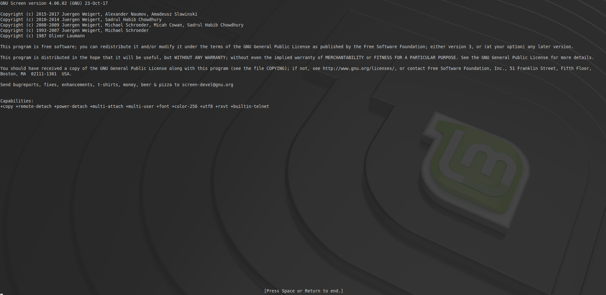

[(back)](teachings.md)
# Good coding practices for Data Scientist beginners

This page was originally written to guide my "Python pour le data scientist" students through the coding part of the data science work. 

Coding for ML should not be restricted to opening jupyter notebooks, and for your co-workers/co-researchers's sake, you should make your code as clear and **reproductible** as possible. This requires not only to get to know coding conventions, but also to understand some very basic parts of how a computer works.

This note is not intented to be a complete computer science course, and is only meant to be an agregation of the most useful coding tips I've learned and wished I had been taught. I am not a specialist of coding conventions, or coding efficiency, and if there are some mistakes in that page, feel free to report on the github repo. I just think that, even if data scientists are not developpers, they should have some autonomy with coding, and understand some basics.

The note is thus organized in four themes: 
- *OS/command line*, which will remain very basic (it is meant for data scientists, not developpers!). The most important part for a data scientist is the remote part, as most data scientist will have to execute code on remote servers or virtual instances.
- *Versioning, packaging, reproductibility*, which focus on git, virtual environments, and introduces things like docker.
- *Computational efficiency tips*, which focus on how to parallelize code with python (this will rmain basic), how not to overload RAM, and some mistakes to avoid.
- *Python coding conventions and tips*, which is less useful as it is mainly for your code's aethetics, but can be welcomed when wanting to use automatic tools to, for instance, automatically generate documentation.

# General OS/computer-related skills


## 0. Operating System

What is an operating system? To stay simple, an operating system is the interface between your hardware and your software programs. There are two main types of OS (for basic users) : Unix-based OS and non-Unix-based OS. Unix-based OS are OS like Linux distributions, and Apple's OSX. Non-Unix based OS are OS like, mainly, Windows.

In this note, I will only focus on Unix-based OS, but command equivalents for Window Powershell can be found on the internet. 

Some of the main components of the hardware your OS is handling are:
- **CPU** : (central processing unit) this is where computations/logic operations are made by the computer. CPU processors can have multiple cores to parallelize computations on.
- **GPU** : (graphical processing unit) is another type of computation unit of the computer, which is slower than CPUs, but is more adapted to parallelization.
- **RAM** : (random access memory) is a type of memory support that is restrained in capacity but very fast to access. This is a short-term memory that is erased whenever the computer is turned off.
- **Hard memory** : this is the long-term memory disk that stores files when the computer is off. Accessing the hard disk memory is more time-consumming than accessing RAM.

It can be useful to read a bit on the functionning of these components, to better optimize your code. 

OS usually provide 2 types of interfaces to use them : 
- *Command line interface*, which is the most basic, and at the same time powerful way to talk to the OS.
- *Graphical user interface*, which is probably the interface you're used to. The information and processes are represented in a graphical way. This might seem more easy-to-use, but it is slow for basic things like navigating in the file system, creating directories, writing files, etc.

In the next section, I'm going to focus on some very basic things about command line interfaces.

## 1. Command line

### 1.1 What is a command line?
A command-line interpretor is a program that takes your commands as an input and produces the output of the command. There is no mouse or graphical feature : everything can be done with a keyboard.

On Linux/ubuntu-based, you can open your command line interpretor / terminal with the ctrl+alt+t shortcut. You can also search for the "Terminal" program. It works approximately the same for OSX.

### 1.2 Navigating

Most of the basic commands you'll never forget are the navigation commands.

First, print the working directory you're in : 
```bash
pwd
```
pwd stand for 'print working directory'. 
On my computer, it outputs for instance : 
```bash
/home/salome/Documents
```
```/``` symbolizes the root : this is where all directories start. Then, the path to my current directory is indicated, with each directory/subdirectory separated by a ```/```. Generally, you will always be in your ```home``` directory : this is where all your files will be stored. Other directories from the root are handled by the OS, so try not to mess with them if you're not used to your OS. Some directories are of interest though : ```bin``` contains all the binaries of the installed programs on your computers, and ```tmp``` is a temporary directory, erased when your turn the computer off. You can store temporary files here. ```usr``` sometimes contain shared programs (when there are multiple users on the computer).

To list all the files and subdirectories, use the command:
```bash
l
```
or 
```bash
ls
```

```l``` with no argument after will list the files and subdirectories of the working directory you're in. You can put an argument after the command to precise the path you want to list the files of:

```bash
ls /home/salome/
```
Would output:
```bash
Bureau  Documents  Images  Modèles  Musique  Public  Téléchargements  Vidéos
```
To access the full description of a command, always type ```man ls```, to get to know all the options and parameters of the ```ls``` command for instance. 

To keep this note short and simple, I will not detail that much the other commands, but mostly present name and purpose so that you can search the rest by yourself by using ```man```. 

Creating a directory:
```bash
mkdir
```

Removing a file or directory:
```bash
rm
```

Moving a file or a directory:
```bash
mv
```

Copying a file or a directory:
```bash
cp
```

Creating an empty text file:
```bash
touch
```

Opening and editing a file from the command line can be done with ```vi```, ```vim```, ```nano``` or other programs.

Reading a file:
```bash
more
```
Reading the end of a file:
```bash
tail
```

These are the very basics for navigation and edition that, once you're used to use them, will allow you to do lots of things very quickly. Obviously, many other commands exist, and you can check the internet to get to know any of them.


### 1.3 Installing programs and downloading files

You can download and install programs from the command line using an packet manager. I will only present the most popular.

On Ubuntu and ubuntu-based distributions of Linux, you can use ```apt-get```.
Generally, the syntax is:
```bash
sudo apt-get install my_programm
```
Where ```my_programm``` is the name of the programm you want to install. For instance, I can install Mozilla Firefox from the command line by typing: ```sudo apt-get install firefox```. The ```sudo``` beginning of the command stands for "super user do" or something similar. It means that you're using super user (which is a kind of admin) rights to execute the command you want to execute. You will then be asked for your password. If you come from Windows, it's just when Windows asks you for your password to install new software.

On OSX, you have to install ```homebrew```, which is not installed by default on your computer. To do so, type:
```bash
/usr/bin/ruby -e "$(curl -fsSL https://raw.githubusercontent.com/Homebrew/install/master/install)"
```
Then to install programs you'll only have to type 
```bash
brew install my_programm
```
If you don't find the program you're searching for, it might be because ```homebrew``` doesn't have all the packages sources by default. To overcome that, install and use ```cask```. You can get all the instructions on [Homebrew's cask website](https://github.com/Homebrew/homebrew-cask).

To download files from the internet, you can use ```wget``` or ```curl```.

## 2. Remote coding

For a data scientist, remotely coding on a server or virtual instance can be a major part of the job. Here are some basics.

### 2.1 SSH

SSH is a secure protocol to connect remotely on a distant server, i.e. another computer that is connected to the internet, has an IP address, and accepts ssh connections.
Other protocols exists but ssh is very simple and popular, so I will only focus on that.

To connect on the remote host as the user ```user```, supposing the host has an IP adress ```hostip``` : 

```bash
ssh user@hostip
```
You will then be asked for you login password on the host computer. After that, you're in the other computer, controlling things from the command line.

Depending on the configuration of your host, you might be able to add your RSA public key to the ssh configuration files to skip the password login part.

Most virtual instance providers, as gcp, microsoft azure, aws will provide you with an host ip and enable you to create one or multiple users on the instance you created, after setup. You will then be able to connect via ssh.

However, there is one drawback to ssh : if the wifi runs out of service or if you close your terminal, the connection is closed and the programs you were running stop. To avoid such situations, programs like ```screen``` or ```tmux``` exist.

### 2.2 Screen and equivalents

```screen``` is a program enabling to run other programs from a virtual terminal. This might seem a bit abstract, so I'm going to describe what happens when you use the ```screen``` command.

When typing:
```bash
screen
```
You enter a new "virtual" page:

When pressing Return, you have a new terminal running. This is your screen, in an *attached* state. 

You can run all the programs you want in this screen. To *detach* from your screen, use **ctrl+a+d**. You will then return to the main terminal you were running with ssh. 

If you want to come back to the screen you were running, type : 
```bash
screen -r
```
The screen program will then display a list of the screens that are currently running, with their id. Once you've spotted the id ```id``` of the screen you want to resume, type:
```bash
screen -r id
```

The ```tmux``` program is an alternative to ```screen```.


### 2.3 Sharing files, Synchronizing directories

To share files between your computer and your remote host, you can use two programs : 
```bash
scp original_file destination_file
```
The remote destination can be specified with the following syntax : 
```bash
scp original_file user@hostip:path_to_dest
```

Or in the other case, if you want to retrieve a file on the host to get it to your computer:
```bash
scp user@hostip:path_to_src dest_path
```

An alternative that enables synchronization and parallelization is ```rsync```. Check out the [documentation](https://rsync.samba.org/) for more details. ```sshfs``` is another alternative. 

### 2.4 Cheating : VSCode remote extension

When you want to write code on another server, it is sometimes annoying to send the files repeatedly to the server, test, fix a typo or a bug, send again, etc. The code editor VSCode has an extension that enables to open a VSCode window that is directly connected via ssh to the server. This is particularly convenient while remotely developing.

Check [VSCode remote development documentation](https://code.visualstudio.com/docs/remote/ssh) for all the details.

# Code versioning and packaging, reproductibility

## 1. Versioning

### 1.1 What is code versioning?

### 1.2 Git introduction

### 1.3 Github, gitlab

## 2. Environments

### 2.1 Why using virtual environments? 

### 2.2 Conda, Miniconda

### 2.3 Virtual env, pip

## 3. Other ressources

### 3.1 How to create a pypi package?

### 3.2 Docker

# Computational efficiency tips

### 1. Multiprocessing

### 2. Garbage collector

### 3. Some mistakes I've made that you could avoid

# Python coding conventions and tips

## 1. PEP8

### 1.1 What is PEP8?

### 1.2 Linters

### 1.3 Cheating : Black

## 2. Documenting your code

### 2.1 Docstrings

### 2.2 Automatically generate a documentation

### 2.3 Publish your documentation online


